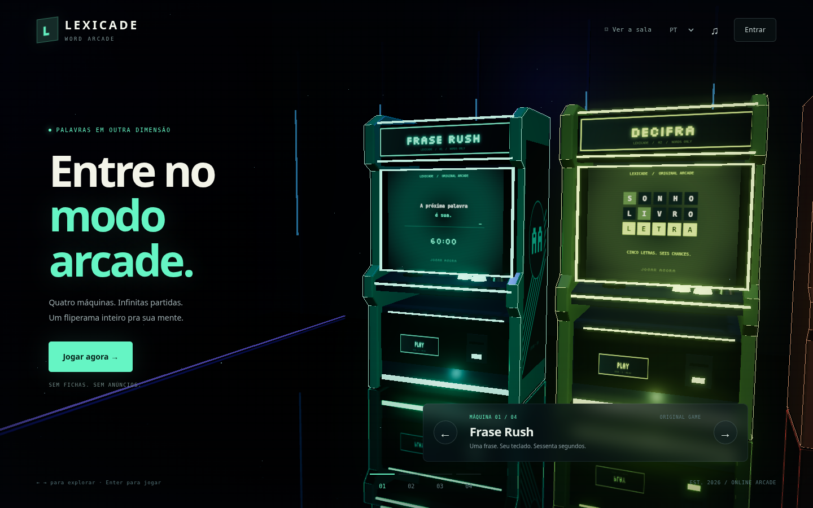

# LEXICADE — fliperama 3D

Uma sala de arcade em **3D real, renderizada com WebGL**. Escolha uma máquina, veja a câmera se aproximar e jogue dentro da tela do gabinete. Gabinetes, iluminação, reflexos, letreiros e interfaces são originais.



[Ver o jogo dentro da máquina](docs/images/frase-rush.png) · [Ver no celular](docs/images/sala-mobile.png)

A revisão 2 substitui o catálogo e os menus da primeira versão por **quatro máquinas**:

| Máquina | Partida |
|---|---|
| **Frase Rush** | Digite frases durante 60 segundos. O relógio começa na primeira digitação; a próxima frase aparece automaticamente. |
| **Decifra** | Descubra uma palavra de cinco letras em seis tentativas. |
| **LexiMaze** | Colete letras em ordem, escape das sombras e avance pelos labirintos. |
| **Anagrama** | Desembaralhe palavras e acumule pontos em 60 segundos. |

Sem escolha de duração, conteúdo, sobrevivência ou dificuldade antes de começar. Navegue com as setas da sala, os botões ou clique na própria máquina. Login, progresso e ajustes ficam em painéis sobre o ambiente 3D. Os temas alteram a sala e os gabinetes; há prévia e botão Salvar alterações. Uma playlist original de três faixas acompanha a sala com pausa/avanço e controles compactos no celular. Som e música começam ligados, com reprodução liberada pela primeira interação se o navegador exigir. O visitante joga e salva progresso localmente.

## Rodar no Windows

Node.js 22 ou superior, navegador atualizado e aceleração gráfica recomendada. **Não precisa de `npm install` nem de build.** Three.js e Supabase estão incluídos localmente com licenças.

Na pasta que contém `package.json`:

```powershell
npm start
```

Abra o endereço mostrado no PowerShell; o padrão é `http://localhost:5173`. Ctrl+C encerra o servidor. Se PowerShell bloquear `npm.ps1`, use `npm.cmd start`. Para outra porta: `npm start -- --port 5174`.

Já baixou a primeira versão? Pare o servidor anterior e baixe o ZIP atualizado do GitHub em uma pasta nova. O ZIP não contém `.git`; não execute `git pull` nessa cópia. Veja [GUIA-INICIANTE](docs/GUIA-INICIANTE.md).

## Supabase

URL e publishable key recebidas já estão **somente em `src/core/config.js`**. A chave pública não permite administrar o banco. O site integra contas e salvamento por RPC; tabelas são instaladas pelo proprietário:

- **Projeto vazio:** executar `supabase/INSTALAR-TUDO.sql` uma vez no SQL Editor. Instalação completa em uma transação.
- **Primeira versão já instalada:** executar apenas `supabase/migrations/004_arcade_focus.sql`; preserva contas, pontuações e itens.
- Configurar e-mail, Site URL e redirects; testar uma conta real conforme [SETUP-SUPABASE](docs/SETUP-SUPABASE.md).

Google continua opcional e desligado. Não usar secret key/service_role no navegador. O agente não acessou ou alterou o banco remoto.

## Estrutura

- `src/arcade/`: sala, câmera, gabinetes, iluminação, texturas, painéis e execução dos quatro jogos.
- `src/arcade/games/`: partidas diretas de frases e anagramas.
- `src/ui/controllers/`: Decifra e labirinto, reutilizados na tela do gabinete.
- `src/core/`: autenticação, API, idioma, armazenamento e pontuação.
- `src/styles/room.css` e `screen.css`: sala e tela da máquina.
- `data/games.json`: somente as quatro máquinas ativas; `data/arcade/phrases.json`: 30 frases originais por idioma.
- `vendor/three/`: Three.js 0.180.0 e módulos necessários; `vendor/supabase-2.57.4.js`: cliente Supabase.
- `supabase/`: migrações, instalação única, seed e testes.
- `docs/`: guia, plano, validação, publicação, licenças e pendências.

Os módulos/dados dos jogos anteriores permanecem por compatibilidade e histórico; não integram o catálogo. Seus endereços antigos retornam à sala. As IDs existentes dos quatro jogos foram mantidas para preservar recordes.

## Testes e utilidades

```powershell
npm test
```

```powershell
npm run validate
```

```powershell
node tests/update-cache.mjs
```

```powershell
node tests/generate-sql.mjs
```

```powershell
npm run package
```

Testes PostgreSQL opcionais: [supabase/tests/README.md](supabase/tests/README.md). Evidências da revisão 2, incluindo câmera, celular, partidas e offline: [VALIDACAO](docs/VALIDACAO.md). Metas de conteúdo do documento original não são os requisitos da nova experiência; limitações relevantes estão em [PENDENCIAS](docs/PENDENCIAS.md).

## Publicar

Cloudflare Pages: branch `main`, framework `None`, comando da hospedagem `exit 0`, saída `.`. Nenhum build de aplicação. Antes de lançar, configurar domínio, Auth e revisar termos/conteúdo. [DEPLOY](docs/DEPLOY.md) explica o processo.

## Alterar ou ampliar

Cada máquina é descrita em `data/games.json`; posição/câmera em `src/arcade/navigation.js`, modelo em `cabinet.js` e ambiente em `environment.js`. Ajuste um destes módulos por vez e confirme a interação na tela da máquina. Um novo jogo precisa de controlador, regras testáveis, métricas/limites SQL, traduções e cache; não adicionar dezenas de ajustes à entrada.

Idiomas: traduções completas em `data/i18n/`, conteúdo em `data/words/` e frases em `data/arcade/phrases.json`. Interface `pt-BR` corresponde a `pt` no conteúdo/banco. Novos idiomas exigem atualizar configuração e constraints SQL.

Fontes e licenças: [LICENCAS](docs/LICENCAS.md). O salvamento no GitHub não publica o site.
