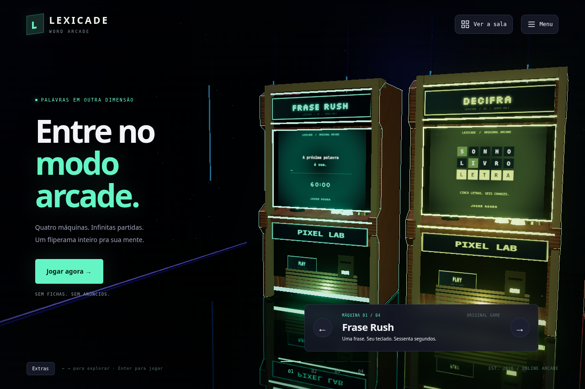
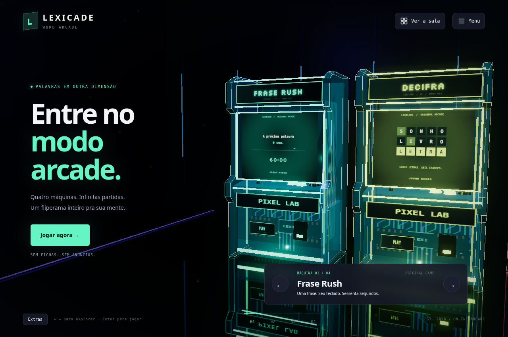
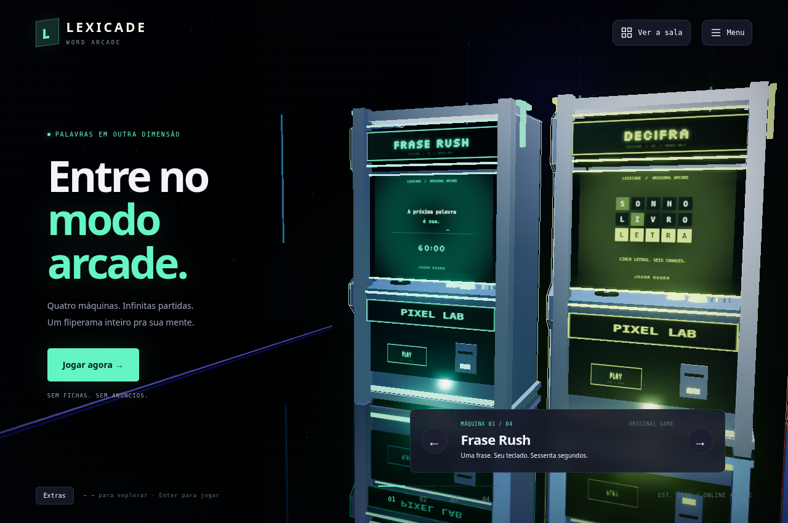

<div align="center">
  
  <h1>LEXICADE</h1>
  <p><strong>Um fliperama de palavras. Uma sala em 3D. Seu próximo recorde.</strong></p>
  <p>Quatro máquinas, partidas diretas e gabinetes com personalidade.</p>
  <p>
    
    
    
    
  </p>
</div>


<p align="center">
  <a href="#-começar-no-vs-code-windows">Rodar no VS Code</a> ·
  <a href="#-conectar-o-supabase">Supabase</a> ·
  <a href="#-publicar-na-vercel">Publicar na Vercel</a> ·
  <a href="docs/GABINETES.md">Galeria de gabinetes</a> ·
  <a href="docs/GUIA-INICIANTE.md">Guia para iniciantes</a>
</p>

## ⚡ Começar no VS Code — Windows

**Já abriu a pasta do projeto no VS Code?** Vá em **Terminal → Novo Terminal** e execute:

```powershell
npm.cmd start
```

Abra no navegador o endereço exibido no terminal. A porta padrão é **5173**. Deixe o terminal aberto enquanto joga; **Ctrl+C** encerra o servidor.

**Não é necessário executar `npm install` para rodar o site.** As bibliotecas utilizadas pelo navegador já estão incluídas em `vendor/`. O Node.js executa o servidor local, os testes e o build de publicação.

### Primeira vez? Siga estes passos

1. Instale [Node.js](https://nodejs.org/en/download) — versão **22 ou superior**, preferencialmente uma versão LTS — e [Visual Studio Code](https://code.visualstudio.com/). Se já os possui, não precisa reinstalar.
2. Neste repositório, clique em **Code → Download ZIP** e depois **Extrair Tudo** no Windows.
3. No VS Code, escolha **Arquivo → Abrir Pasta**. Abra a pasta que contém **`package.json` e `index.html`**. Pode haver uma pasta `LEXICADE-main` dentro de outra: escolha a que contém esses arquivos.
4. Abra **Terminal → Novo Terminal**.
5. Execute `npm.cmd start` e abra o endereço mostrado.

No início do terminal deve aparecer **`lexicade@2.3.0`**. Não abra `index.html` diretamente nem rode o projeto dentro do ZIP; use o servidor local.

<details>
<summary><strong>Prefere baixar usando Git?</strong></summary>

Instale [Git](https://git-scm.com/downloads) e execute no terminal, dentro da pasta onde quer guardar o projeto:

```powershell
git clone https://github.com/gigio-jpeg/LEXICADE.git
cd LEXICADE
code .
```

O último comando abre o VS Code. Se `code` não for reconhecido, abra o programa pelo menu Iniciar e use **Arquivo → Abrir Pasta**.

Para atualizar uma cópia clonada, pare o servidor e execute na pasta do projeto:

```powershell
git pull origin main
npm.cmd start
```

Uma pasta extraída de ZIP não contém `.git`. Nesse caso, baixe um ZIP atualizado e extraia numa pasta nova.

</details>

<details>
<summary><strong>Outra porta, Linux ou macOS</strong></summary>

Se a porta padrão estiver ocupada:

```powershell
npm.cmd start -- --port 5174
```

Use o endereço com a nova porta que o terminal mostrar. No Linux e macOS, use `npm start`; os demais comandos npm também funcionam sem o sufixo `.cmd`.

</details>

## 🕹️ O que é o LEXICADE?

Uma sala de arcade renderizada em **3D real com Three.js e WebGL**. Você percorre os gabinetes, escolhe uma máquina e vê a câmera se aproximar. A partida acontece na própria tela do fliperama.

O foco é entrar e jogar: quatro jogos principais, sem configurar duração ou dezenas de modos antes de começar. A experiência inclui iluminação, reflexos no chão, letreiros, texturas originais e interface adaptada ao celular.

| Máquina | Como jogar |
|---|---|
| **Frase Rush** | Digite frases por 60 segundos. O relógio começa na primeira digitação e a próxima frase aparece automaticamente. |
| **Decifra** | Descubra uma palavra de cinco letras em até seis tentativas, usando as pistas de cor. |
| **LexiMaze** | Colete letras na ordem, escape das sombras e percorra labirintos. |
| **Anagrama Relâmpago** | Desembaralhe palavras e acumule pontos em 60 segundos. Aceita alternativas válidas com as mesmas letras. |

O Anagrama sorteia palavras reais de 4 a 8 letras: **1.680 em português**, **1.689 em inglês** e **1.687 em espanhol**, com controle de repetição. Não inventa sequências de letras como respostas.

[Ver uma partida na máquina](docs/images/frase-rush.png) · [Ver a sala no celular](docs/images/sala-mobile.png)

## ✨ Recursos da sala

| Recurso | O que faz |
|---|---|
| **Fantasma do recorde** | No Frase Rush, repete o percurso do seu melhor resultado para comparar o ritmo durante a partida. |
| **Duelo ao vivo** | Duas contas competem por convite, com as mesmas frases, relógio do servidor, placar e recompensa única. |
| **Sala reativa** | Combos disparam ondas no chão e partículas 3D. Recordes ganham aviso e confete. |
| **Seu fliperama** | Personalize nome, acabamento, adesivo e modelo; desbloqueie novas opções ao completar partidas. |
| **Menu organizado** | Entrar, Meu progresso, Ranking, Ajustes, Extras, idioma e player em um único lugar. |
| **Playlist original** | Seis composições com melodias, harmonias e ritmos distintos; pausa e próxima música dentro do menu. |
| **Temas e monitor retrô** | Prévia de temas, linhas de varredura e brilho nas telas, com botão para salvar as preferências. |
| **Três idiomas** | Português, inglês e espanhol para interface e conteúdo. |

### Gabinetes com identidade própria

| Modelo | Desbloqueio | Visual |
|---|---:|---|
| **Original** | Sempre disponível | Neon e identidade de cada máquina |
| **Madeira retrô** | 5 partidas | Veios de madeira, molduras de latão e grelha vintage |
| **Circuito cristal** | 15 partidas | Carcaça translúcida com placas eletrônicas e chips visíveis |
| **Cromado orbital** | 30 partidas | Metal escovado, reflexos, colunas largas e antenas luminosas |

Em **Menu → Extras**, escolha um cartão e **arraste a prévia 3D para girar**. Pode visualizar modelos bloqueados antes de desbloqueá-los. Clique em **Salvar alterações** para aplicar um modelo disponível.

**Restaurar padrão** está sempre disponível e não apaga partidas nem desbloqueios. Os modelos especiais aplicam os acabamentos aos detalhes, preservando seus materiais.

| Madeira retrô | Circuito cristal | Cromado orbital |
|:---:|:---:|:---:|
|  |  |  |

[Ver a galeria e os detalhes dos modelos →](docs/GABINETES.md)

### Controles e música

- **Explorar:** setas da interface, teclado ou clique nas máquinas.
- **Ver a sala:** botão identificado com texto e ícone, inclusive no celular.
- **Jogar:** botão Jogar agora, clique no gabinete ou Enter quando o foco não está em outro controle.
- **Sair da máquina:** botão de saída ou Escape.
- **Pausar uma partida comum:** botão de pausa na tela do jogo. O duelo usa o relógio do servidor e continua ao sair.
- **Música:** abra Menu para pausar, retomar ou avançar, inclusive durante uma partida.

A playlist tem **Neon Boulevard**, **Coin Slot Funk**, **After Hours Jazz**, **Boss Circuit**, **Moonlit Carousel** e **Orbital Breaks**. São faixas sintetizadas localmente, com estilos de synth, funk, jazz, arcade, valsa e breakbeat. Não precisa baixar áudios adicionais.

Som e música começam habilitados, mas o navegador pode exigir o primeiro clique ou toque para liberar o áudio. A preferência de pausa é preservada. A opção **Reduzir movimento** desativa as comemorações animadas e mantém as confirmações textuais.

## ☁️ Conectar o Supabase

**Os jogos visitantes funcionam sem criar conta ou instalar o banco.** Supabase é necessário para autenticação, progresso de contas, ranking, duelo e personalização sincronizada.

A configuração pública deste projeto está em [`src/core/config.js`](src/core/config.js), nos campos `supabaseUrl` e `supabaseKey`. Para usar outro projeto, substitua-os pela URL e pela chave **publishable** dele. Não coloque `service_role`, secret keys, senhas do banco ou credenciais SMTP no navegador, no README ou no GitHub.

### 1. Instalar ou atualizar o banco

Abra seu projeto no [painel do Supabase](https://supabase.com/dashboard) e vá em **SQL Editor → New query**.

**Banco vazio:** abra [`supabase/INSTALAR-TUDO.sql`](supabase/INSTALAR-TUDO.sql), clique em **Raw**, copie todo o código, cole no editor e clique em **Run**. O arquivo reúne as migrações 001–007 e o seed em uma transação.

**Banco já instalado:** execute apenas as migrações que ainda faltam, na ordem. Não reaplique o instalador completo.

| Última migração que você já aplicou | Execute agora, nesta ordem |
|---|---|
| 003 | [004](supabase/migrations/004_arcade_focus.sql) → [005](supabase/migrations/005_arcade_social.sql) → [006](supabase/migrations/006_cabinet_finishes.sql) → [007](supabase/migrations/007_cabinet_models.sql) |
| 004 | [005](supabase/migrations/005_arcade_social.sql) → [006](supabase/migrations/006_cabinet_finishes.sql) → [007](supabase/migrations/007_cabinet_models.sql) |
| 005 | [006](supabase/migrations/006_cabinet_finishes.sql) → [007](supabase/migrations/007_cabinet_models.sql) |
| 006 | [007](supabase/migrations/007_cabinet_models.sql) |
| 007 | Nenhuma atualização de banco para esta versão |

Para cada arquivo: **Raw → copiar o SQL → colar no SQL Editor → Run**. Comandos como `npm.cmd start` e `Get-Content` pertencem ao terminal do Windows, não ao SQL Editor.

As migrações preservam os dados existentes e validam permissões, desbloqueios e recompensas no servidor. Mantenha RLS habilitado.

### 2. Configurar os endereços de autenticação

Em **Authentication → URL Configuration**, configure os endereços do site que você está usando.

Para desenvolvimento na porta padrão:

| Campo | Valor |
|---|---|
| Site URL | `http://localhost:5173` |
| Redirect URL | `http://localhost:5173/pages/login.html` |
| Redirect URL | `http://localhost:5173/pages/redefinir-senha.html` |
| Redirect URL | `http://localhost:5173/pages/escolher-nome.html` |

Se usar outra porta, substitua `5173` por ela em todas as entradas. Na produção, use o domínio HTTPS real da Vercel ou seu domínio próprio.

Confira que o provedor **Email** está habilitado. Para receber cadastros de outras pessoas, verifique os limites do remetente padrão e configure SMTP no painel quando necessário. Google é opcional e vem desativado; exige configuração própria.

### 3. Conferir a integração

Faça login, confirme o e-mail quando solicitado e complete seu perfil. Termine uma partida e confira **Menu → Meu progresso**. Para testar o duelo, use **duas contas diferentes**, uma no navegador normal e outra em janela anônima ou em outro aparelho.

A migração 005 configura Realtime para `duel_matches` e `duel_players` quando a publicação está disponível. O duelo também tem atualização periódica e tentativa de reconexão. O convite vale 15 minutos para começar; uma partida iniciada dura 60 segundos após a contagem regressiva.

[Guia Supabase](docs/SETUP-SUPABASE.md) · [Publicação e teste em produção](docs/DEPLOY-VERCEL.md)

### Onde meus dados ficam?

| Dado | Onde é salvo |
|---|---|
| Progresso e personalização de visitante | Neste navegador |
| Fantasma do recorde | Neste navegador, separado por conta e idioma |
| Progresso e personalização de uma conta | Supabase |
| Preferências de áudio, tema e idioma | Neste navegador |
| Partidas de duelo | Supabase |

Dados locais não são transferidos automaticamente entre localhost, domínio publicado, outro navegador ou outro aparelho. Depois de carregar o cache com internet, os quatro jogos visitantes ficam disponíveis offline; login, ranking, duelo e sincronização precisam de conexão.

## 🚀 Publicar na Vercel

Não precisa instalar a CLI da Vercel. Entre em [vercel.com](https://vercel.com), conecte o GitHub e escolha **Add New → Project → importar LEXICADE**.

| Configuração | Valor |
|---|---|
| Branch de produção | `main` |
| Framework Preset | `Other` |
| Root Directory | Raiz do repositório |
| Build Command | `npm run build` |
| Output Directory | `dist` |
| Install Command | `node --version` |
| Node.js | 24.x, ou outra versão suportada ≥22 |
| Environment Variables | Nenhuma necessária nesta versão |

O [`vercel.json`](vercel.json) já configura build, saída e cabeçalhos. A pasta `dist` contém os arquivos públicos do site, sem SQL, testes ou documentação. Não publique a raiz inteira do repositório.

Após **Deploy**, copie o domínio de produção. No Supabase, use esse domínio em **Site URL** e nos três Redirect URLs indicados acima. Teste login, uma partida salva e duelo com duas contas pelo endereço publicado.

Para ajustar metadados ao endereço real, execute na cópia clonada, substituindo o domínio do exemplo pelo seu:

```powershell
node tests/configure-domain.mjs https://seu-projeto.vercel.app
node tests/update-cache.mjs
npm.cmd test
npm.cmd run build
```

Envie as alterações revisadas para a branch `main`; a Vercel fará outra publicação. Não precisa configurar chaves privadas para esse build.

[Passo a passo completo da Vercel →](docs/DEPLOY-VERCEL.md) · [Alternativa Cloudflare Pages](docs/DEPLOY.md)

## 🧰 Comandos úteis

Execute estes comandos no terminal, na pasta que contém `package.json`:

| Comando no Windows | Para que serve |
|---|---|
| `npm.cmd start` | Iniciar o servidor local |
| `npm.cmd start -- --port 5174` | Usar outra porta |
| `npm.cmd test` | Executar os testes automatizados |
| `npm.cmd run validate` | Validar conteúdo e mostrar metas editoriais pendentes |
| `npm.cmd run build` | Criar o pacote público em `dist` |
| `node tests/update-cache.mjs` | Atualizar a lista de arquivos do cache offline |
| `node tests/generate-sql.mjs` | Regerar o instalador SQL para banco vazio |
| `npm.cmd run package` | Gerar o pacote de distribuição do projeto |

Os testes PostgreSQL locais são opcionais e usam uma dependência separada: consulte [`supabase/tests/README.md`](supabase/tests/README.md). Ela não é necessária para jogar ou publicar.

As verificações realizadas e seus limites estão em [VALIDACAO](docs/VALIDACAO.md). Testes locais de SQL e autenticação simulada não substituem o teste do seu projeto Supabase hospedado.

## 🗂️ Estrutura do projeto

```text
LEXICADE/
├── index.html                 # Entrada da sala 3D
├── src/
│   ├── arcade/                # Sala, câmera, gabinetes, prévia e duelo
│   │   └── games/             # Frase Rush e Anagrama
│   ├── core/                  # Auth, API, áudio, idioma e armazenamento
│   ├── ui/                    # Painéis e controladores dos jogos
│   └── styles/                # Interface, temas e tela das máquinas
├── data/                      # Catálogo, palavras, frases e traduções
├── assets/                    # Fontes, ícones e recursos visuais
├── vendor/                    # Three.js e cliente Supabase locais
├── supabase/                  # Migrações 001–007, seed e testes SQL
├── pages/                     # Páginas de conta e autenticação
├── tests/                     # Testes e utilidades de desenvolvimento
├── tools/build.mjs            # Geração do pacote de produção
├── docs/                      # Guias, galeria, validação e licenças
├── sw.js                      # Cache offline
└── vercel.json                # Configuração de publicação
```

O front-end usa módulos JavaScript, HTML, CSS, Canvas e Web Audio. A sala usa **Three.js 0.180.0**, e a integração usa o cliente **Supabase 2.57.4**, incluídos em `vendor/`.

Módulos e dados de jogos anteriores permanecem por compatibilidade e histórico, mas o catálogo ativo tem somente quatro máquinas. As IDs dos jogos foram preservadas para manter os recordes.

## 🔧 Problemas comuns

| Problema | O que fazer |
|---|---|
| `npm.ps1` bloqueado no PowerShell | Use `npm.cmd start`; não precisa mudar a política de execução. |
| `node` ou `npm` não reconhecido | Confira a instalação do Node e reabra o VS Code/terminal. |
| Não encontrou `package.json` | Abra a pasta correta; confira se há outra pasta dentro do ZIP extraído. |
| Porta ocupada | Encerre o servidor anterior com Ctrl+C ou use `--port 5174`. |
| Apareceu uma versão antiga | Confira a versão no terminal, a pasta e o endereço; recarregue com Ctrl+F5. |
| Música não começou | Clique/toque no site, abra Menu e confira pausa, volume e Ajustes. |
| Não conseguiu salvar um modelo | Confira o desbloqueio, a conexão, o login e se aplicou a migração 007. |
| SQL mostra erro perto de `Get` ou `npm` | Cole o conteúdo do arquivo `.sql`, não um comando do terminal. |
| E-mail de login não chegou | Confira spam, URLs Auth e limites/configuração SMTP no Supabase. |
| WebGL indisponível | Use navegador atualizado e confira aceleração gráfica; existe uma sala simplificada de fallback. |

Não apague progresso local para tentar corrigir cache. Se a versão continuar antiga, consulte a seção de solução de problemas do [guia de publicação](docs/DEPLOY-VERCEL.md).

## 📚 Documentação e créditos

- [Guia para iniciantes no Windows](docs/GUIA-INICIANTE.md)
- [Configuração do Supabase](docs/SETUP-SUPABASE.md)
- [Publicação na Vercel](docs/DEPLOY-VERCEL.md)
- [Galeria dos gabinetes](docs/GABINETES.md)
- [Plano do projeto](docs/PLANO.md)
- [Validação e evidências](docs/VALIDACAO.md)
- [Pendências de conteúdo e revisão](docs/PENDENCIAS.md)
- [Fontes, bibliotecas e licenças](docs/LICENCAS.md)

Os gabinetes são modelados em 3D no próprio site. Texturas e trilhas sintetizadas são locais; conteúdo linguístico e bibliotecas têm suas fontes e licenças documentadas. As imagens deste README são capturas reais da aplicação.
