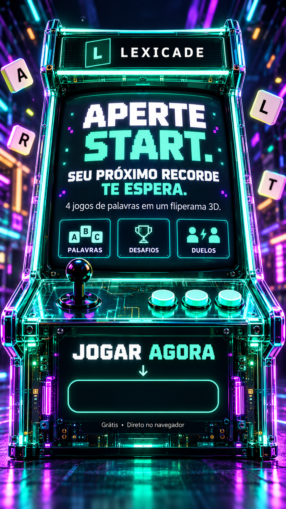
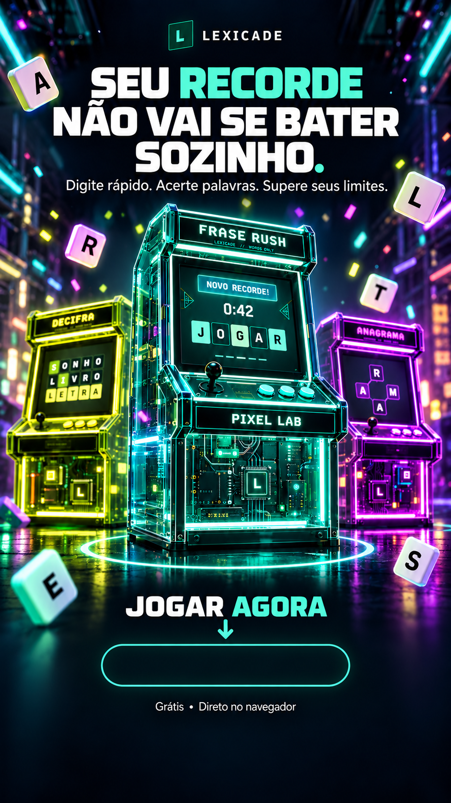
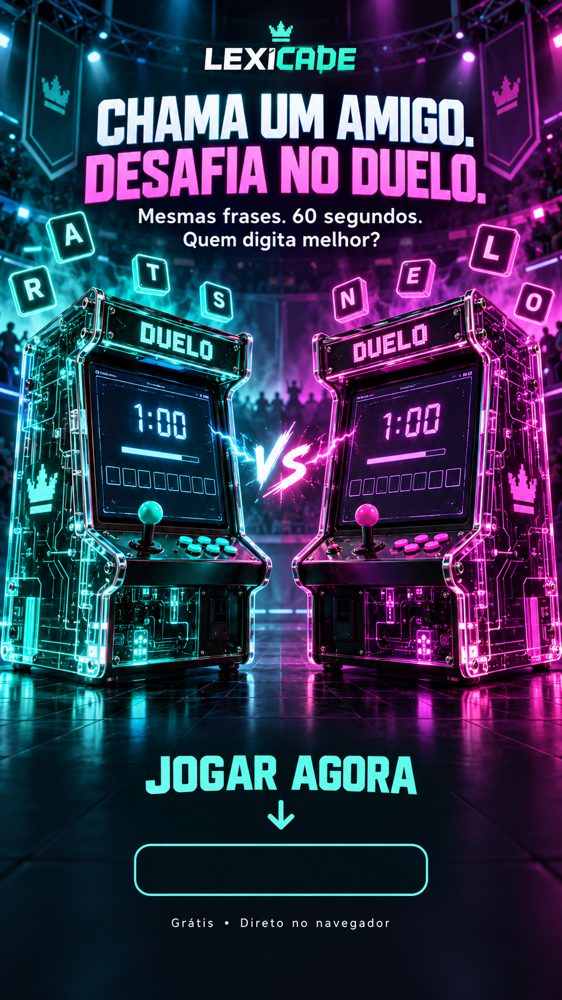
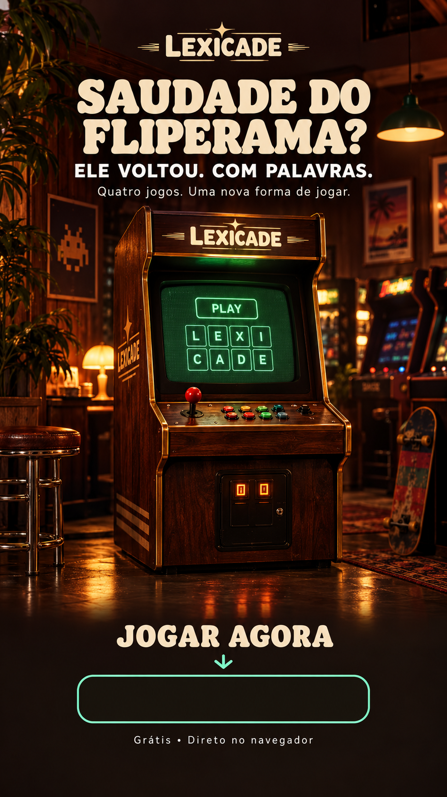
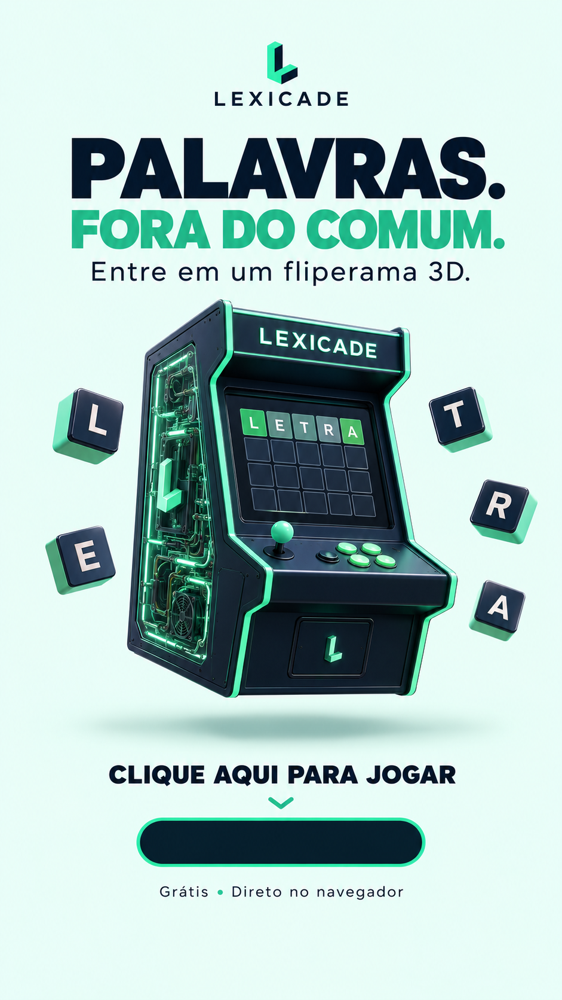
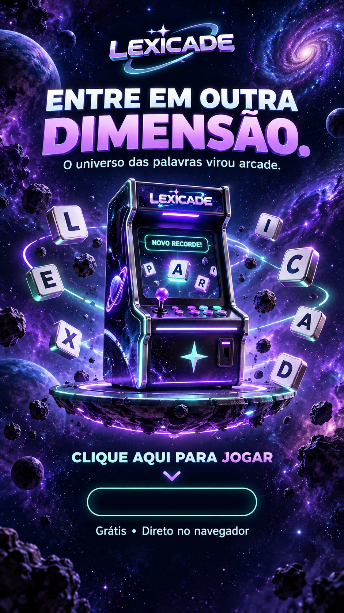

# LEXICADE — seis anúncios para Instagram

Seis artes verticais em formato 9:16, com espaço vazio para adicionar o adesivo de link do Instagram. São ilustrações publicitárias inspiradas na identidade do jogo, não capturas literais da interface.

**[Baixar as seis artes em ZIP](https://raw.githubusercontent.com/gigio-jpeg/LEXICADE/main/docs/midia/anuncios/lexicade-6-anuncios.zip)**

| Modelo | Ideia | Arquivo |
|---|---|---|
| 01 · Dentro do arcade | As informações aparecem na tela do fliperama; o link vai no painel frontal | [Abrir PNG](https://raw.githubusercontent.com/gigio-jpeg/LEXICADE/main/docs/midia/anuncios/01-arcade.png) |
| 02 · Recorde | Chamada para superar seu próprio resultado | [Abrir PNG](https://raw.githubusercontent.com/gigio-jpeg/LEXICADE/main/docs/midia/anuncios/02-recorde.png) |
| 03 · Duelo | Duas máquinas, contraste de cores e desafio a um amigo | [Abrir PNG](https://raw.githubusercontent.com/gigio-jpeg/LEXICADE/main/docs/midia/anuncios/03-duelo.png) |
| 04 · Retrô | Madeira, luz quente e nostalgia | [Abrir PNG](https://raw.githubusercontent.com/gigio-jpeg/LEXICADE/main/docs/midia/anuncios/04-retro.png) |
| 05 · Minimalista | Fundo claro, espaço e tipografia forte | [Abrir PNG](https://raw.githubusercontent.com/gigio-jpeg/LEXICADE/main/docs/midia/anuncios/05-minimal.png) |
| 06 · Cósmico | Arcade espacial e letras em órbita | [Abrir PNG](https://raw.githubusercontent.com/gigio-jpeg/LEXICADE/main/docs/midia/anuncios/06-cosmico.png) |

## Prévia

| Dentro do arcade | Recorde | Duelo |
|:---:|:---:|:---:|
|  |  |  |

| Retrô | Minimalista | Cósmico |
|:---:|:---:|:---:|
|  |  |  |

## Colocar o link no Story

1. Baixe a imagem desejada e abra **Instagram → Criar Story**.
2. Selecione a imagem da galeria. Evite dar zoom para não cortar a composição.
3. Abra o menu de adesivos e escolha **Link**.
4. Cole a URL **do jogo publicado**, não o endereço do repositório GitHub.
5. Personalize o texto do adesivo para **JOGAR AGORA** ou **CLIQUE AQUI**.
6. Posicione o adesivo dentro do retângulo vazio, ajustando seu tamanho. Confira se a interface do Instagram não cobre o link, e mova-o um pouco para cima se necessário.
7. Abra uma prévia, confira o endereço e publique.

O retângulo desenhado na arte não é clicável: quem abre o site é o adesivo nativo do Instagram. Imagens no feed ou em Reels não recebem esse mesmo adesivo; nesses formatos, use uma chamada para o link da bio e ajuste o destino no seu perfil.

Para salvar no computador, abra o PNG e use **Salvar imagem como…**. No celular, mantenha a imagem pressionada e salve. As artes não incluem endereço fixo ou QR code, permitindo usar o domínio que você escolher.
